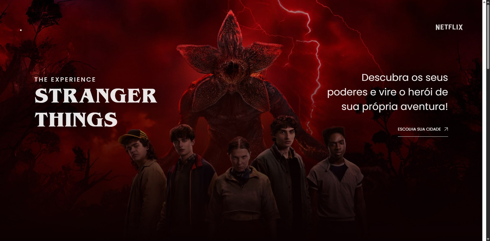

# 🔦 Stranger Things: The Experience


Landing page inspirada na experiência imersiva de **Stranger Things**, desenvolvida durante um evento do **Gustavo Campelo**. O foco do projeto foi trabalhar animações e interações de rolagem com **GSAP**, incluindo preloader animado, rolagem suave com parallax, animações acionadas pelo scroll e animação de textos letra por letra.

🔗 **[🚀 Clique aqui para ver o projeto online](https://acali10.github.io/StrangerThingsDevart/)**

---

## 📷 Demonstração



---

## ✨ Funcionalidades

- **Preloader animado:** o logotipo em SVG é "desenhado" traço a traço e depois preenchido de vermelho, antes de a página ser revelada.
- **Rolagem suave com parallax:** a página desliza suavemente e as imagens de fundo da seção principal se movem em velocidades diferentes.
- **Animações no scroll:** os cards das cidades e a lista de cidades aparecem com efeito de fade e desfoque conforme o usuário rola a página, e o rodapé sobe com efeito parallax.
- **Textos animados:** títulos e chamadas entram letra por letra.
- **Texto infinito** em movimento no rodapé, feito apenas com CSS.
- **Layout responsivo**, com imagens diferentes para telas de até 600px.

---

## 🛠️ Tecnologias e Conceitos Aplicados

- **HTML5 Semântico:** uso de `<header>`, `<main>`, `<section>`, `<nav>` e `<footer>` para estruturar a página.
- **GSAP:** biblioteca de animações, com os plugins carregados via CDN:
  - **ScrollSmoother:** rolagem suave e efeito parallax (`data-speed`).
  - **ScrollTrigger:** animações vinculadas ao scroll, com `scrub`.
  - **SplitText:** divisão dos textos em linhas, palavras e caracteres para animá-los individualmente.
  - **Timeline:** sequência do preloader, que ao terminar dispara as demais animações da página.
- **CSS Nesting:** aninhamento nativo de seletores para agrupar os estilos de cada seção (`.hero`, `.secaoCidade`, `.secaoDepoimentos`, `.secaoObrigado`, `footer`).
- **Animação de traço em SVG:** `stroke-dasharray` e `stroke-dashoffset` para o efeito de desenhar o logotipo no preloader.
- **`@keyframes` e `mix-blend-mode`:** texto infinito no rodapé com `animation` linear e mistura de cores `color-dodge`.
- **Sobreposição com gradiente:** `linear-gradient` em pseudo-elemento (`:before`) para fundir a imagem do hero com o fundo escuro.
- **Flexbox e `aspect-ratio`:** organização das seções e proporção 16/9 dos cards.
- **Tipografia fluida:** tamanhos em `vw` para os títulos se adaptarem à largura da tela.
- **Imagens responsivas com `<picture>`:** versões em `.webp` para desktop e mobile, escolhidas com `media="(max-width: 600px)"`.
- **Media queries:** ajustes de layout em 1500px, 1400px e 600px.
- **Tipografia Externa:** fonte **Poppins** (Google Fonts) para o texto e **Benguiat** (`@font-face`) para os títulos, remetendo à identidade visual da série.

---

## 💻 Como rodar o projeto localmente

1. Clone o repositório:

```
git clone https://github.com/acali10/StrangerThingsDevart.git
```

2. Acesse a pasta do projeto:

```
cd StrangerThingsDevart
```

3. Abra o arquivo `index.html` em seu navegador.

> É necessário estar conectado à internet, pois o GSAP e a fonte Poppins são carregados por CDN.

---

## 🔜 Melhorias futuras

- Melhorar a acessibilidade (textos alternativos nas imagens e respeito à preferência de movimento reduzido do usuário).
- Otimizar o carregamento das imagens e do preloader.
- Tornar os botões funcionais, levando o usuário para a escolha de cidade.

---

## ⚠️ Aviso

Este é um projeto **sem fins comerciais**, criado apenas para fins de estudo. Stranger Things, Netflix e as demais marcas e imagens citadas pertencem aos seus respectivos donos.

---

## 📄 Licença

O código deste projeto está sob a licença MIT. Veja o arquivo [LICENSE](LICENSE) para mais detalhes.

---

## 👤 Autora

Desenvolvido por Caline Nepomoceno:

- GitHub: [@acali10](https://github.com/acali10)